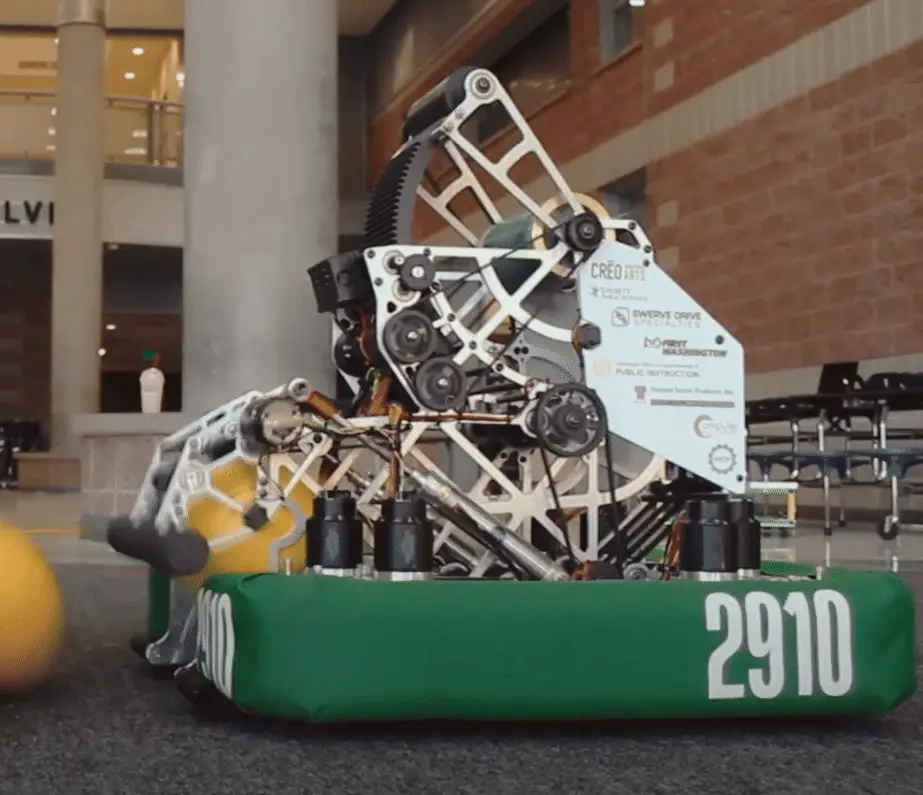
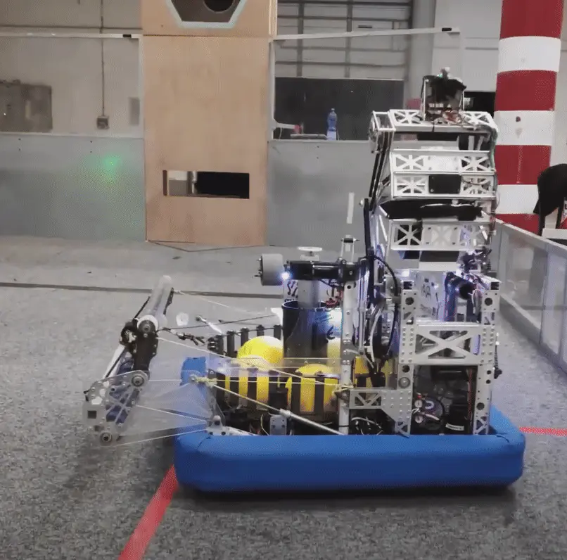

import Aside from '../../../../../components/Aside.astro';
import Slides from '../../../../../components/Slides.astro';

Welcome to Stage 2! This section covers FRC mechanism design, emphasizing CAD skills, best practices, and key engineering concepts. Each project guide explains design decisions and criteria, promoting independent CAD work with less step-by-step instruction.

## Shooter Mechanisms

Shooters are used in FRC games when you need to score in high places but are not allowed to physically reach up to the scoring position. A flywheel is the most common method of scoring as illustrated below.

While most shooting games involve launching a ball, the fundamentals between ball shooters and shooters for non-spherical objects (discs or rings) remain roughly the same.

<Slides>
  
  FRC Team 2910's 2021 Robot Launching Game Pieces

  
  FRC Team 1690's 2021 Robot Launching Game Pieces
</Slides>

### Flywheel Shooters

The most common way to launch game pieces is with flywheel shooters. Other methods, such as catapults or punchers, tend be more challenging to execute with the required accuracy/fire rate and rely on different concepts than flywheel shooters.

<Slides>
  
  1678's 2022 Flywheel Shooter - launched 9.5" diameter inflated balls

  
  1678's 2024 Flywheel Shooter - launched 14" diameter foam rings
</Slides>

[This video](https://youtu.be/QZKDnRvLhrA) is a good slow-motion look at how a ball gets propelled out of a shooter.

Other mechanism examples and deep dives for shooters can be found on the [ball shooters page](/mechanism-examples/shooter/). The design handbook page will have a deeper dive when the shooter design page is completed.
