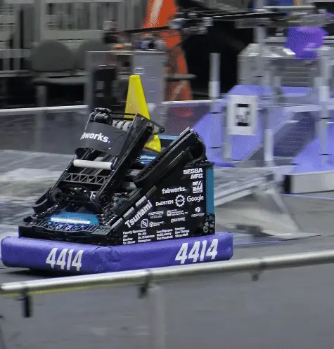

import Slides from '../../../../../components/Slides.astro';
import Gif from '@components/Gif.astro';

## Elevators

Elevators pop up commonly in FRC and are used to move mechanisms in a compact linear fashion. This is usually to reach higher places with a mechanism, reach far out from your frame perimeter, or even climb on a field element. Elevators are typically classified by the way they are "Rigged". Elevator "Rigging" is what allows the motor to transmit motion to each stage. FRC elevators are usually rigged to be either "Cascade" or "Continuous."

<Slides>
  
  2468's Cascade Elevator

  
  4414's Continuous Elevator
</Slides>

Watch the following match videos to see [2468's 2023 Robot with a cascade-rigged elevator](https://www.youtube.com/watch?v=RAFjZgB_72w) and [4414's 2023 Robot with a continuous-rigged elevator](https://youtu.be/PKPuqpe1Wlg) in action.

### Utilizing COTS Components

Elevators as designed most typically may be out of the scope of a lower-capability team because of the amount of custom metal parts that need to be bought or manufactured, but once you know how one works and have designed one, you may be able to make one with minimal manufacturing capabilities and time required. This project will be discussing the design of a cascade-rigged elevator over a continuous-rigged elevator due to the availability of COTS parts and minimal manufacturing required for a cascade-rigged elevator.

### Cascade Elevator

Cascade elevators are characterized by the way the stages move. In a cascade rigged system, each elevator stage moves the same distance from its parent stage.

<Gif src="../img/2d/cascade.webp" center alt="Cascade Motion">Cascade Motion</Gif>

### Comparison

| **Category** | **Cascade Rigging** | **Continuous Rigging** |
|--------------|---------------------|------------------------|
| Number of Stages | Possible to make cascade elevators with more than 3 stages, but designing the rigging gets harder especially if width constrained. | Additional stages are relatively trivial to add |
| Stage Order | Since all of the stages move together at once, your center of mass will be higher in the middle range of extension as compared to continuous rigging | Stages move up based on the friction between stages and force to move each stage. If properly constructed, the inner stages should move first. |
| COTS | Many options available for cable rigging. | Not as many options available for cable rigging |
| Gearbox (Given the same end effector speed and force) | Can utilize intermediary stages, which have higher force than the final stage, for situations like climbing (See [2056's 2018 robot](https://www.youtube.com/watch?v=47A83OfzYDw)) | Requires less reduction, but requires a shifting gearbox to have different high speed and high force modes |
| Pass Through | Can be achieved by moving the location of the rigging | Can be achieved by moving the location of the rigging. Intermediary stage positions may be indeterminate depending on how well tuned the stage movement order is. |
